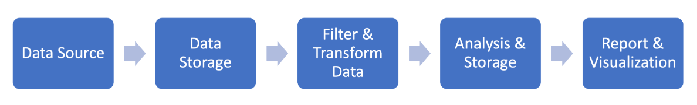

# Big Data and Analysis with Python

With the advent of social media and its widespread acceptance came the unprecedented need for data management. Now billions of gigabytes of data are produced every day and much of it is generated by the end-users. Organizations recognized the huge potential in harnessing this data using predictive and machine learning algorithms to generate insights. But before tackling that challenge, came the challenge of efficiently and systematically storing and handling this data in a way that made it available for quick access.

## What is Big Data?

Big data is the management of large sets of data, both structured and unstructured. Today, this large amount of data is stored in the form of data warehouses and data lakes, both on servers and in the cloud.

### Main Characteristics of Big Data (3Vs):

- **Volume**: The size of data under question which may require different handling to traditional storage.
- **Variability/Veracity**: Inconsistencies in data; difficult to intervene manually at large scale.
- **Velocity**: The speed of handling data; essential for continuously active data sources like social media.

## Workflow Pipeline

The whole pipeline can be summarized as below:

## Why Python for Big Data?

### 1. Ease of Use
- Quick setup and execution with minimal code.

### 2. Open Source & Licensing
- Cost-effective with a wide array of libraries and frameworks.

### 3. Active Community
- Vast and supportive community aiding development and problem resolution.

### 4. Powerful Libraries
- Direct support for Big Data with packages that bridge Python with other tools.

### 5. Compatibility with Hadoop and Spark
- Libraries like PySpark and support for HDFS enhance Big Data capabilities.

### 6. High Processing Speed
- OOP features and fast prototyping make Python efficient.

### 7. Portability and Scalability
- Easy extensibility, cross-platform support, and rich ecosystem of tools and APIs.

## Common Python Libraries for Big Data

- **NumPy**: Numerical computing.
- **Pandas**: Data analysis and manipulation.
- **Scikit-learn**: Machine learning algorithms.
- **SciPy**: Scientific computing.

## Big Data-Specific Python Libraries

- **RedShift & S3**: Amazon cloud storage and warehousing.
- **BigQuery**: Google’s RESTful API-based data warehouse.
- **PySpark**: Distributed data processing framework.
- **Kafka**: Publish-subscribe messaging system.
- **Pydoop**: Interface between Hadoop and Python, supports HDFS.

