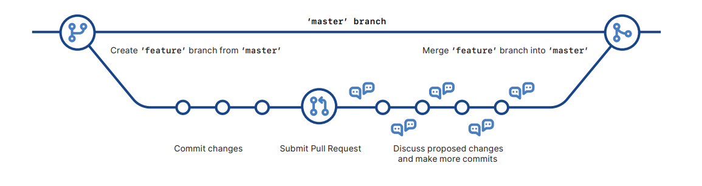

### **Git & Version Control Cheat Sheet**

---

###  **Git Setup**
| Command | Description |
|--------|-------------|
| `git config --global user.name "Your Name"` | Set Git username |
| `git config --global user.email "you@example.com"` | Set Git email |
| `git config --global color.ui auto` | Enable colorized output |

---

###  **Create or Clone Repositories**
| Command | Description |
|--------|-------------|
| `git init` | Initialize a new Git repository |
| `git clone <url>` | Clone a repository from GitHub or other remote |

---

###  **Stage & Commit Changes**
| Command | Description |
|--------|-------------|
| `git status` | Show file status and changes |
| `git add <file>` | Stage a specific file |
| `git add .` | Stage all modified and new files |
| `git commit -m "message"` | Commit staged changes with a message |

---

###  **Branching & Merging**
| Command | Description |
|--------|-------------|
| `git branch` | List all branches |
| `git branch <name>` | Create a new branch |
| `git checkout <name>` | Switch to a branch |
| `git switch <name>` | Alternative way to switch branch |
| `git merge <branch>` | Merge specified branch into current |
| `git branch -d <name>` | Delete a branch |

---

###  **Sync with Remote Repos**
| Command | Description |
|--------|-------------|
| `git remote -v` | View configured remotes |
| `git fetch` | Download latest changes (no merge) |
| `git pull` | Fetch + merge remote changes |
| `git push` | Push commits to remote |
| `git push -u origin <branch>` | Push and set upstream for a branch |

---

###  **View History & Changes**
| Command | Description |
|--------|-------------|
| `git log` | View full commit history |
| `git log --oneline` | Compact commit log |
| `git log --graph --all --decorate` | Visual commit tree |
| `git diff` | See unstaged changes |
| `git diff --staged` | See staged changes |
| `git show <commit>` | View a specific commit |
| `git blame <file>` | Who edited each line of a file |

---

###  **Undo & Reset**
| Command | Description |
|--------|-------------|
| `git checkout -- <file>` | Discard changes in working directory |
| `git reset <file>` | Unstage file from staging area |
| `git reset --soft <commit>` | Undo commits, keep changes staged |
| `git reset --hard <commit>` | ⚠️ Reset to commit, discard all changes |

---

###  **.gitignore**
| Usage | Example |
|-------|---------|
| Ignore files/folders from being tracked by Git | `node_modules/`, `*.log`, `.env` |
| Templates | [GitHub .gitignore templates](https://github.com/github/gitignore) |

---

**GitHub Flow**

---

### 📘 **Git Glossary**
| Term | Description |
|------|-------------|
| **Git** | Version control system |
| **GitHub** | Git repository hosting |
| **Commit** | Snapshot of project state |
| **Branch** | Movable pointer to a commit |
| **Clone** | Local copy of a remote repo |
| **Remote** | External Git repo (e.g., GitHub) |
| **Fork** | Your own copy of another repo |
| **Pull Request (PR)** | Merge request from one branch to another |
| **HEAD** | Current branch reference |

---

### ✅ **Version Control Essentials**
- Track changes in source code
- View project history
- Collaborate in teams safely
- Enable CI/CD pipelines and automation

---

